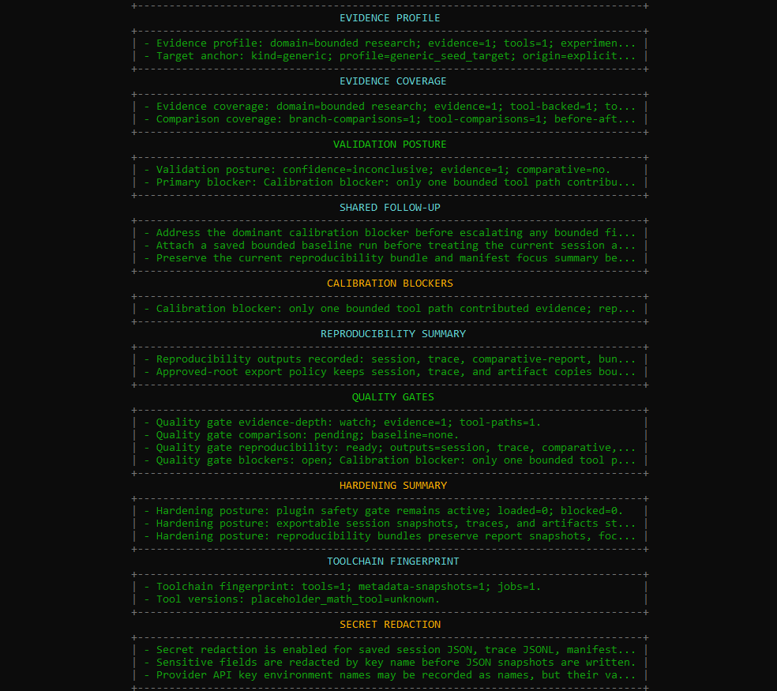
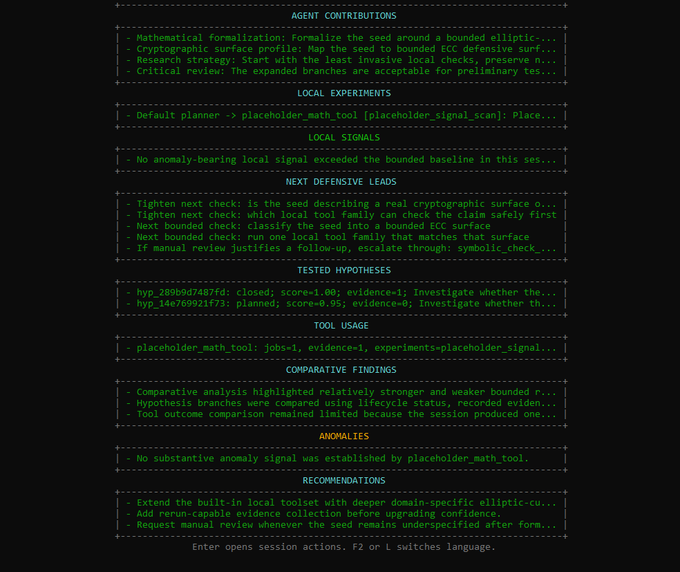
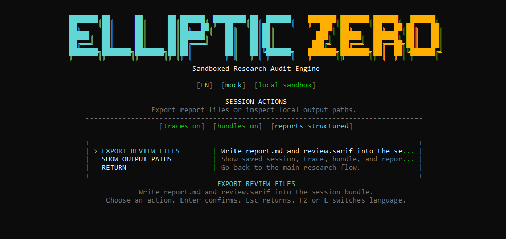

# EllipticZero

<p align="center">
  <a href="https://github.com/ECD5A/EllipticZero/actions/workflows/codeql.yml"></a>
  
  
  
  
</p>

<p align="right"><a href="README.ru.md">Русская версия</a></p>

**EllipticZero Research Lab** is an independent source-available project by
**ECD5A** for scoped smart-contract security reviews and defensive ECC research.

It is built for researchers, audit teams, and protocol teams that want local
evidence instead of model-only output.

Simple outside, strict inside: load a contract or choose an ECC target, write the
research idea, let bounded agents select local checks, then review evidence,
risk lanes, confidence, and follow-up guidance.

<p align="center">
  
</p>

<details>
<summary>Session report and export preview</summary>

<p align="center">
  
</p>

<p align="center">
  
</p>

<p align="center">
  
</p>

<p align="center"><em>Report export action</em></p>

<p align="center">
  
</p>

</details>

## What You Get

- a local-first workflow for smart-contract audits and defensive ECC research
- tool-backed evidence instead of model-only claims
- normalized smart-contract finding records and compact cards with risk, evidence, line hints, fix direction, and recheck path
- scoped smart-contract signals for signature, oracle, upgrade, and token-accounting review lanes
- reproducible sessions, traces, manifests, bundles, and replay
- evidence coverage, toolchain fingerprints, and secret-redacted JSON exports
- SARIF review exports with source-line regions when local hints are available
- benchmark packs and golden cases for evaluator-facing smoke checks
- menu-first golden cases, experiment packs, evaluation summaries, baseline comparison, and provider context preview
- cautious reports with manual-review boundaries and remediation direction

**License TL;DR:** Read, evaluate, run locally, and use for research or internal
review under `FSL-1.1-ALv2`. Building a competing commercial product,
hosted/SaaS service, OEM integration, white-label product, resale package, or
paid security platform around EllipticZero requires a separate commercial
license. Each published version becomes Apache-2.0 after two years.

## Why EllipticZero

EllipticZero is built for evidence-first local research, not unchecked agent
autonomy. The system keeps agent reasoning, local computation, artifacts,
replay, confidence, and manual-review boundaries visible in one workflow.

Its goal is to help a careful reviewer narrow what should be checked next, what
the local evidence actually supports, and what still requires human judgment.

## Evaluate Quickly

If you are reviewing EllipticZero as a researcher, security team, or potential
commercial partner, start with:

- [EVALUATION.md](EVALUATION.md) for the evaluation path and benchmark scorecard
- [SECURITY.md](SECURITY.md) for sandbox, provider, artifact, and data-handling
  boundaries
- [examples/golden_cases/README.md](examples/golden_cases/README.md) for stable
  smart-contract and ECC smoke cases
- [COMMERCIAL_LICENSE.md](COMMERCIAL_LICENSE.md) if your use case involves a
  product, hosted service, OEM, white-label, resale, or similar commercial path

## Detailed Capabilities

- orchestrator-centered sessions with Math, Cryptography, Strategy, Hypothesis, Critic, and Report agent roles
- smart-contract parser, compile, repo inventory, protocol-map, review-lane, benchmark, casebook, and finding-card paths
- scoped smart-contract review families for access control, upgrade/storage, asset-flow, vault/share, oracle, liquidation, token accounting, signatures, rewards, AMM/liquidity, bridge/custody, staking, treasury, insurance, and related protocol surfaces
- optional local adapters for `Slither`, `Foundry`, and `Echidna`; Slither findings keep severity and source locations, while Foundry can add build/test evidence for projects with `foundry.toml`
- cached known-case profile matching from allowlisted metadata sources such as SmartBugs and Slither detector families; remote code is not executed
- ECC benchmark packs for point anomalies, encoding edges, curve aliases, curve-family transitions, subgroup/cofactor and twist hygiene, and bounded domain completeness
- golden/synthetic cases with expected report shapes for evaluator-facing smart-contract and ECC smoke checks
- traces, manifests, bundles, replay, doctor/self-check, evidence coverage, toolchain fingerprints, and secret-redacted JSON snapshots
- `mock` by default, plus `openai`, `openrouter`, `gemini`, and `anthropic` when configured

## Quick Start

Requirements:

- Python 3.11+
- local filesystem access for artifacts
- an API key only if you want to move beyond `mock`

Install:

```powershell
python -m venv .venv
.\.venv\Scripts\Activate.ps1
python -m pip install --upgrade pip
pip install -e .[lab]
```

Or use:

```powershell
.\scripts\setup_local_lab.ps1
```

Smart-contract-focused local setup:

```powershell
.\scripts\setup_local_lab.ps1 -Profile smart-contract-static
```

Launch the interface:

```powershell
python -m app.main --interactive
```

For no-key evaluation from the console, open `EVALUATION LAB` from the
main interactive menu. From there you can run golden cases, choose
experiment packs, inspect project or saved-run summaries, compare against a
baseline bundle, update known-case metadata, and preview hosted-provider
context before live agents.

Run the self-check:

```powershell
python -m app.main --doctor
```

Run a safe evaluation case:

```powershell
python -m app.main --golden-case contract-vault-permission-lane
```

Inside the interactive console, use `F2` or `L` to switch between `EN` and `RU`.

## Common Commands

Smart-contract audit from a local file:

```powershell
python -m app.main --domain smart_contract_audit --contract-file .\contracts\Vault.sol "Audit the contract for low-level call review surfaces and externally reachable value flow."
```

Smart-contract audit from inline code:

```powershell
python -m app.main --domain smart_contract_audit --contract-code "pragma solidity ^0.8.20; contract Vault {}" "Review the contract for reachable admin, upgrade, and external-call surfaces."
```

Smart-contract benchmark pack from a local file:

```powershell
python -m app.main --domain smart_contract_audit --contract-file .\contracts\Vault.sol --pack contract_static_benchmark_pack "Benchmark the contract with bounded static analysis and parser-to-surface cross-checks."
```

ECC research session:

```powershell
python -m app.main "Inspect whether secp256k1 metadata labels remain consistent across local reasoning and tool output."
```

Bounded ECC exploratory mode:

```powershell
python -m app.main "Explore whether ECC point parsing and on-curve checks reveal bounded defensive research leads." --research-mode sandboxed_exploratory
```

Routing overview:

```powershell
python -m app.main --show-routing
```

Built-in golden evaluator cases:

```powershell
python -m app.main --list-golden-cases
python -m app.main --golden-case contract-repo-scale-lending-protocol
```

For the safe evaluation case from `Quick Start`, expected first-screen anchors
are `Repo Triage Snapshot`, `ECC Triage Snapshot`, `Remediation Delta Summary`,
`Finding Cards`, `Evidence Coverage`, reproducibility outputs, and lower
export-quality notes for toolchain fingerprint and secret redaction.

Additional CLI utilities:

```powershell
python -m app.main --evaluation-summary
python -m app.main --evaluation-summary --evaluation-summary-format json
python -m app.main --evaluation-summary --replay-bundle .\artifacts\bundles\session_id
python -m app.main --provider openrouter --provider-context-preview "Preview hosted-provider context before running live agents."
python -m app.main --replay-bundle .\artifacts\bundles\session_id --export-sarif .\artifacts\sarif\session_id.sarif
python -m app.main --replay-bundle .\artifacts\bundles\session_id --export-report-md .\artifacts\reports\session_id.md
python -m app.main --list-synthetic-targets
python -m app.main --list-packs
python -m app.main --live-provider-smoke openai --live-smoke-model gpt-4.1-mini
python -m app.main --live-provider-smoke openrouter --live-smoke-model openrouter/auto
python -m app.main --replay-session .\artifacts\sessions\session_id.json
python -m app.main --domain smart_contract_audit --contract-file .\contracts\Vault.sol --compare-session .\artifacts\sessions\baseline.json "Re-run the scoped audit and record before/after deltas against the saved baseline session."
```

## Runtime Notes

- Configuration is resolved from defaults, `configs/settings.yaml`, environment variables, and optional `.env`.
- Supported providers: `mock`, `openai`, `openrouter`, `gemini`, `anthropic`.
- The default route uses one provider/model for all roles. Per-agent overrides are optional.
- OpenRouter is supported as an OpenAI-compatible hosted path. Direct smoke checks use `openrouter/auto` unless a model is pinned.
- Local tooling can include managed `solc`, smart-contract checks, optional static analyzers, `SymPy`, `Hypothesis`, `z3-solver`, bounded mutation probes, ECC testbeds, and optional `SageMath`.
- Inputs stay simple: pasted smart-contract code, inline code, local `.sol` / `.vy` files, or free-form ECC seeds. Local contract files can derive a bounded repository root automatically.
- Reports start with a compact review snapshot, then cover smart-contract repo triage, inventories, protocol maps, casebook matches, finding cards, review queues, remediation notes, residual-risk lanes, ECC triage, benchmark posture, family coverage, and comparison/regression notes when local evidence supports them.
- Comparison flags (`--compare-session`, `--compare-manifest`, `--compare-bundle`) attach saved baselines to fresh bounded runs for cautious before/after and regression-oriented notes.
- Completed runs can store session JSON, trace JSONL, reproducibility bundles, `overview.json`, comparative reports, `report.md`, and `review.sarif` under `artifacts/`.
- The interactive console can export `report.md` and `review.sarif` from the session-actions menu without requiring export commands.
- Export policy keeps manifest and bundle material inside approved storage roots, redacts likely secrets, and treats SARIF/finding cards as review items rather than proof.
- Unsafe local plugin path layouts are blocked before registry loading. CodeQL and Dependabot workflows support repository hygiene.

See `.env.example` for local configuration options.

## Project Docs

- [docs/INDEX.md](docs/INDEX.md) is the full documentation map.
- [EVALUATION.md](EVALUATION.md) is the fastest path for reviewers and commercial evaluators.
- [SECURITY.md](SECURITY.md), [REPRODUCIBILITY.md](REPRODUCIBILITY.md), and [REPORT_SPEC.md](REPORT_SPEC.md) define the evidence, safety, and reporting boundaries.
- [LICENSE_FAQ.md](LICENSE_FAQ.md), [COMMERCIAL_LICENSE.md](COMMERCIAL_LICENSE.md), and [TRADEMARKS.md](TRADEMARKS.md) define licensing, commercial use, and brand boundaries.

## Verification

```powershell
python -m pip check
python -m ruff check .
python -m compileall app tests scripts
pytest -q
```

The project passes the test suite in mock mode.

## Donate

If EllipticZero is useful to your work, you can support the project here:

- Bitcoin (BTC): `1ECDSA1b4d5TcZHtqNpcxmY8pBH1GgHntN`
- USDT (TRC20): `TSWcFVfqCp4WCXrUkkzdCkcLnhtFLNN3Ba`

## Responsible Use

Use EllipticZero only for authorized local research. Keep experiments bounded, reversible, and inspectable.

## License

EllipticZero is licensed under **FSL-1.1-ALv2**.

The public repository is source-available for evaluation, research, internal
use, and other permitted purposes defined by the license.

Each version becomes available under Apache License 2.0 on the second
anniversary of the date that version was made available.

If you need rights beyond the public license, including competing commercial
use, hosted or managed service use, OEM, white-label, or resale, see
[COMMERCIAL_LICENSE.md](COMMERCIAL_LICENSE.md).

This repository is public, but current versions should not be described as
OSI-approved open-source releases.

Branding rights are not granted under the code license. See
[TRADEMARKS.md](TRADEMARKS.md).

## Commercial Use

Evaluation, research, internal review, and local testing are welcome under the
public license terms.

If your use case involves a competing commercial product, commercial hosted
service, OEM distribution, white-label usage, or resale, you should obtain a
separate commercial license.

If you are unsure whether your deployment or product plan crosses that line,
contact before shipping or selling it.

See [COMMERCIAL_LICENSE.md](COMMERCIAL_LICENSE.md) for the short policy.

## Contact

For commercial licensing, collaboration, and partnership inquiries:

<p>
  <a href="mailto:stelmak159@gmail.com" aria-label="Email"></a>
  &nbsp;
  <a href="https://t.me/ECDS4" aria-label="Telegram"></a>
  &nbsp;
  <a href="https://github.com/ECD5A/EllipticZero" aria-label="GitHub repository"><picture><source media="(prefers-color-scheme: dark)" srcset="https://cdn.simpleicons.org/github/FFFFFF"></picture></a>
</p>
