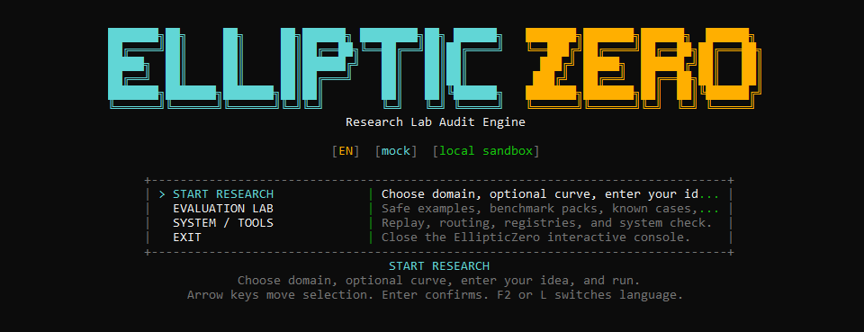
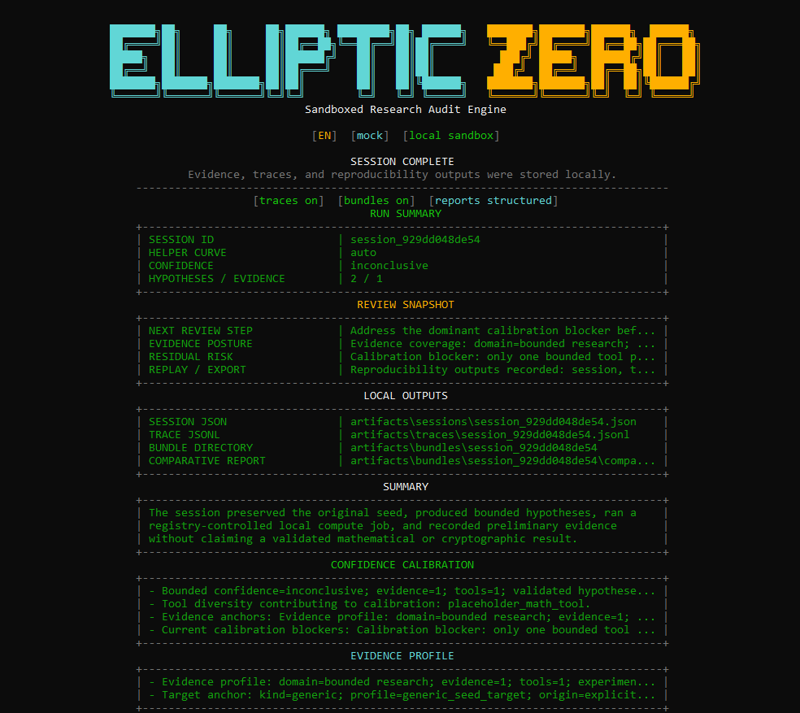

# EllipticZero

[](https://github.com/ECD5A/EllipticZero/actions/workflows/tests.yml)
[](https://github.com/ECD5A/EllipticZero/actions/workflows/codeql.yml)


EllipticZero is a source-available local lab for bounded defensive research in two domains:

- ECC / defensive cryptography research
- smart-contract audit

The user flow stays simple: choose a language, choose a domain, optionally choose a curve or provide contract input, enter a research idea, run a bounded local session, and review the recorded evidence and cautious report.

The repository is public and source-available under `FSL-1.1-ALv2`. Current
versions are not offered under an OSI open-source license, and competing
commercial use, hosted deployment, OEM distribution, or white-label use require
a separate agreement.

## Why EllipticZero

EllipticZero is built for evidence-first local research, not unchecked agent
autonomy. The system keeps agent reasoning, local computation, artifacts,
replay, confidence, and manual-review boundaries visible in one workflow.

Its goal is to help a careful reviewer narrow what should be checked next, what
the local evidence actually supports, and what still requires human judgment.

## Core Strengths

EllipticZero is designed around:

- local-first defensive research and audit workflows
- bounded orchestration for ECC and smart-contract review
- reproducible evidence, traces, manifests, bundles, and reports
- benchmark packs for repeatable comparison and hardening validation
- cautious confidence calibration with manual-review lanes preserved
- source-available evaluation with a commercial licensing path

## Screenshots





## What It Includes

- orchestrator-centered research sessions
- Math, Cryptography, Strategy, Hypothesis, Critic, and Report agents
- sandboxed local runners for symbolic, formal, property-based, fuzz, and ECC testbed checks
- built-in ECC benchmark packs for point anomalies, encoding edges, curve aliases, curve-family transitions, subgroup/cofactor and twist hygiene, and bounded domain completeness
- smart-contract audit tools for parser, compile, repo-scale inventory, first-party vs dependency scoping, protocol maps, review lanes, function-family prioritization, and cross-file priority fusion
- built-in smart-contract corpora for asset-flow, vault/share, oracle freshness, collateral/liquidation and liquidation-fee review, protocol-fee/reserve-buffer/debt accounting, bad-debt socialization, and related protocol-style review families
- bounded repo-scale casebooks for upgrade/storage, governance/timelock, asset-flow, oracle/liquidation, protocol accounting, rewards/distribution, stablecoin/collateral, AMM/liquidity, bridge/custody, staking/rebase, keeper/auction, treasury/vesting, insurance/recovery, and vault/permit lanes, plus optional `Slither`, `Foundry`, and `Echidna` adapters when installed locally
- built-in smart-contract benchmark packs for static baseline review, repo-casebook benchmarking, protocol-style repo benchmarking, upgrade/control benchmarking, governance/timelock benchmarking, rewards/distribution benchmarking, stablecoin/collateral benchmarking, AMM/liquidity benchmarking, bridge/custody benchmarking, staking/rebase benchmarking, keeper/auction benchmarking, treasury/vesting benchmarking, insurance/recovery benchmarking, vault/permission benchmarking, and lending-style protocol benchmarking
- golden/synthetic example cases with expected report shapes for evaluator-facing ECC and smart-contract smoke checks
- traces, manifests, bundles, replay, and doctor/self-check
- `mock` by default, plus `openai`, `openrouter`, `gemini`, and `anthropic` when configured

## Quick Start

Requirements:

- Python 3.11+
- local filesystem access for artifacts
- an API key only if you want to move beyond `mock`

Install:

```powershell
python -m venv .venv
.\.venv\Scripts\Activate.ps1
python -m pip install --upgrade pip
pip install -e .[lab]
```

Or use:

```powershell
.\scripts\setup_local_lab.ps1
```

Smart-contract-focused local setup:

```powershell
.\scripts\setup_local_lab.ps1 -Profile smart-contract-static
```

Launch the interface:

```powershell
python -m app.main --interactive
```

Run the self-check:

```powershell
python -m app.main --doctor
```

Inside the interactive console, use `F2` or `L` to switch between `EN` and `RU`.

## Common Commands

Direct research session:

```powershell
python -m app.main "Inspect whether secp256k1 metadata labels remain consistent across local reasoning and tool output."
```

Bounded exploratory mode:

```powershell
python -m app.main "Explore whether ECC point parsing and on-curve checks reveal bounded defensive research leads." --research-mode sandboxed_exploratory
```

Smart-contract audit from a local file:

```powershell
python -m app.main --domain smart_contract_audit --contract-file .\contracts\Vault.sol "Audit the contract for low-level call review surfaces and externally reachable value flow."
```

Smart-contract audit from inline code:

```powershell
python -m app.main --domain smart_contract_audit --contract-code "pragma solidity ^0.8.20; contract Vault {}" "Review the contract for reachable admin, upgrade, and external-call surfaces."
```

Smart-contract benchmark pack from a local file:

```powershell
python -m app.main --domain smart_contract_audit --contract-file .\contracts\Vault.sol --pack contract_static_benchmark_pack "Benchmark the contract with bounded static analysis and parser-to-surface cross-checks."
```

Routing overview:

```powershell
python -m app.main --show-routing
```

Built-in golden evaluator cases:

```powershell
python -m app.main --list-golden-cases
python -m app.main --golden-case contract-repo-scale-lending-protocol
```

Additional CLI utilities:

```powershell
python -m app.main --list-synthetic-targets
python -m app.main --list-packs
python -m app.main --live-provider-smoke openai --live-smoke-model gpt-4.1-mini
python -m app.main --live-provider-smoke openrouter --live-smoke-model openrouter/auto
python -m app.main --replay-session .\artifacts\sessions\session_id.json
python -m app.main --domain smart_contract_audit --contract-file .\contracts\Vault.sol --compare-session .\artifacts\sessions\baseline.json "Re-run the bounded audit and record before/after deltas against the saved baseline session."
```

## Runtime Notes

- Configuration is resolved from defaults, `configs/settings.yaml`, environment variables, and optional `.env`.
- Supported providers: `mock`, `openai`, `openrouter`, `gemini`, `anthropic`.
- The normal setup is one shared provider/model for all roles. Per-agent overrides are optional.
- OpenRouter is useful as a bounded live-smoke path because it exposes OpenAI-compatible hosted models behind one API key, and the direct smoke path now defaults to `openrouter/auto` unless you explicitly pin another model.
- Optional local tooling can include `SymPy`, `Hypothesis`, `z3-solver`, built-in bounded mutation probes, ECC testbeds, smart-contract audit checks, and `SageMath` when available.
- ECC reporting can now include a short benchmark summary, benchmark posture, family-coverage lines, an ECC coverage matrix, compact benchmark-case summaries, bounded ECC review focus, residual-risk lines, ECC signal-consensus notes, a short ECC validation matrix, cautious ECC comparison-focus lines, ECC benchmark-delta notes, and ECC regression-watch lines when local encoding, family transitions, twist hygiene, subgroup/cofactor, or domain-completeness signals justify them.
- The setup profiles can provision a project-managed Solidity compiler under `.ellipticzero/tooling/solcx` so compile checks and compiler-aware adapters do not depend on a global `solc` install.
- Solidity analysis is version-aware: the contract pragma is read first, then the runtime picks a compatible locally available managed compiler instead of assuming one fixed `solc` version.
- Smart-contract sessions can use pasted code, inline code, or a local `.sol` / `.vy` file as input.
- `doctor` now distinguishes provider configuration from hosted live-smoke readiness, and the direct hosted smoke path shows the effective timeout and request-token cap it used.
- `doctor` now also surfaces the bounded local plugin safety gate and the approved export-root policy used by bundle and manifest export.
- Smart-contract sessions can optionally carry a local contract root so the bounded audit can build a repo-scale inventory, separate first-party from dependency scope, trace entrypoint review lanes, rank function families, summarize risk-family lanes, and compare the repo against bounded casebook scenarios. When a local contract file is used, the interactive flow now derives a bounded local root automatically.
- Smart-contract experiment packs can now structure bounded static benchmarking, repo-casebook benchmarking, protocol-style benchmark passes, and more specific upgrade/control, governance/timelock, rewards/distribution, stablecoin/collateral, AMM/liquidity, bridge/custody, staking/rebase, keeper/auction, treasury/vesting, insurance/recovery, vault/permission, or lending-style benchmark passes; their executed steps are preserved in the session, replay artifacts, and final report.
- New direct CLI comparison flags (`--compare-session`, `--compare-manifest`, `--compare-bundle`) can attach a saved baseline session to a fresh bounded run, so the final report can include cautious before/after and regression-oriented comparison notes.
- Smart-contract reporting can include contract inventory, repo-scale protocol maps, protocol invariants, signal-consensus summaries, validation matrices, benchmark posture summaries, strongest priorities, repo triage, entrypoint review lanes, function-family priorities, and risk-family lane summaries.
- Smart-contract reporting can also include bounded repo-casebook coverage, compact matched case-study summaries, archetype-style case-study labels for governance/timelock, rewards/distribution, stablecoin/collateral, AMM/liquidity, bridge/custody, staking/rebase, keeper/auction, treasury/vesting, insurance/recovery, or similar protocol cases, short priority-case lines, a short gap block for unmatched lanes, benchmark-support notes, casebook triage, and toolchain alignment for the strongest repo lanes.
- Smart-contract reporting can also include benchmark-pack summaries and short benchmark-case summaries when a bounded contract benchmark pack materially shaped the session.
- Smart-contract reporting can also include a casebook coverage matrix, benchmark posture summaries, and toolchain-backed validation posture for the strongest repo lanes, including repo-casebooks that support more than one risk family in the same bounded pass.
- When local signals justify it, smart-contract reporting can also include a short review queue, residual-risk lines for the strongest lane set, exit criteria for the strongest lane, compile status, contract surface summary, built-in pattern findings, protocol-style review focus, remediation-validation notes, remediation follow-up priorities, cautious defensive remediation guidance, external static findings, bounded testbed or repo-casebook comparisons, confidence-calibration notes explaining why the current evidence is still bounded, and before/after comparison lines with regression flags when a saved baseline session is attached.
- Completed runs can write session, trace, comparative, and bundle artifacts under `artifacts/`, and reproducibility bundles now include an `overview.json` snapshot with focus summary, comparison readiness, export-level counts, plus quality-gate and hardening-summary counts.
- Cross-domain reporting can also preserve quality gates and hardening summaries so bounded evidence depth, comparison readiness, export posture, plugin-safety posture, and residual manual-review lanes remain legible in one place.
- Reproducibility manifests and bundles now filter out artifact references that resolve outside the approved local storage roots, and session/trace copies are exported only when their source paths stay inside those approved roots.
- Unsafe local plugin path layouts are blocked before registry loading.
- GitHub Actions now include a dedicated CodeQL workflow for bounded code-scanning coverage on the Python codebase, and Dependabot can keep Python/github-actions dependencies under review.

See `.env.example` for local configuration options.

## Project Docs

- [docs/INDEX.md](docs/INDEX.md)
- [EVALUATION.md](EVALUATION.md)
- [CHANGELOG.md](CHANGELOG.md)
- [docs/USE_CASES.md](docs/USE_CASES.md)
- [docs/ENVIRONMENT_PROFILES.md](docs/ENVIRONMENT_PROFILES.md)
- [ARCHITECTURE.md](ARCHITECTURE.md)
- [AGENTS.md](AGENTS.md)
- [LICENSE_FAQ.md](LICENSE_FAQ.md)
- [LICENSE_TRANSITION.md](LICENSE_TRANSITION.md)
- [COMMERCIAL_LICENSE.md](COMMERCIAL_LICENSE.md)
- [TRADEMARKS.md](TRADEMARKS.md)
- [REPRODUCIBILITY.md](REPRODUCIBILITY.md)
- [REPORT_SPEC.md](REPORT_SPEC.md)
- [SECURITY.md](SECURITY.md)
- [CONTRIBUTING.md](CONTRIBUTING.md)
- [examples/README.md](examples/README.md)
- [examples/SAMPLE_OUTPUTS.md](examples/SAMPLE_OUTPUTS.md)
- [examples/golden_cases/README.md](examples/golden_cases/README.md)
- [examples/golden_cases/RUNBOOK.md](examples/golden_cases/RUNBOOK.md)
- [examples/golden_cases/EXPECTED_REPORT_SHAPES.md](examples/golden_cases/EXPECTED_REPORT_SHAPES.md)

## Verification

```powershell
python -m pip check
python -m ruff check .
python -m compileall app tests scripts
pytest -q
```

The project currently passes the test suite in mock mode.

## Support

- Bitcoin (BTC): `1ECDSA1b4d5TcZHtqNpcxmY8pBH1GgHntN`
- USDT (TRC20): `TSWcFVfqCp4WCXrUkkzdCkcLnhtFLNN3Ba`

## Responsible Use

Use EllipticZero only for authorized local research. Keep experiments bounded, reversible, and inspectable.

## License

EllipticZero is licensed under **FSL-1.1-ALv2**.

The public repository is source-available for evaluation, research, internal
use, and other permitted purposes defined by the license.

Each version becomes available under Apache License 2.0 on the second
anniversary of the date that version was made available.

If you need rights beyond the public license, including competing commercial
use, hosted or managed service use, OEM, white-label, or resale, see
[COMMERCIAL_LICENSE.md](COMMERCIAL_LICENSE.md).

This repository is public, but current versions should not be described as
OSI-approved open-source releases.

Branding rights are not granted under the code license. See
[TRADEMARKS.md](TRADEMARKS.md).

## Commercial Use

Evaluation, research, internal review, and local testing are welcome under the
public license terms.

If your use case involves a competing commercial product, commercial hosted
service, OEM distribution, white-label usage, or resale, you should obtain a
separate commercial license.

If you are unsure whether your deployment or product plan crosses that line,
contact before shipping or selling it.

See [COMMERCIAL_LICENSE.md](COMMERCIAL_LICENSE.md) for the short policy.

## Contact

For commercial licensing, collaboration, and partnership inquiries:

- Email: `stelmak159@gmail.com`
- Telegram: `@ECDS4`
- Repository: `https://github.com/ECD5A/EllipticZero`
