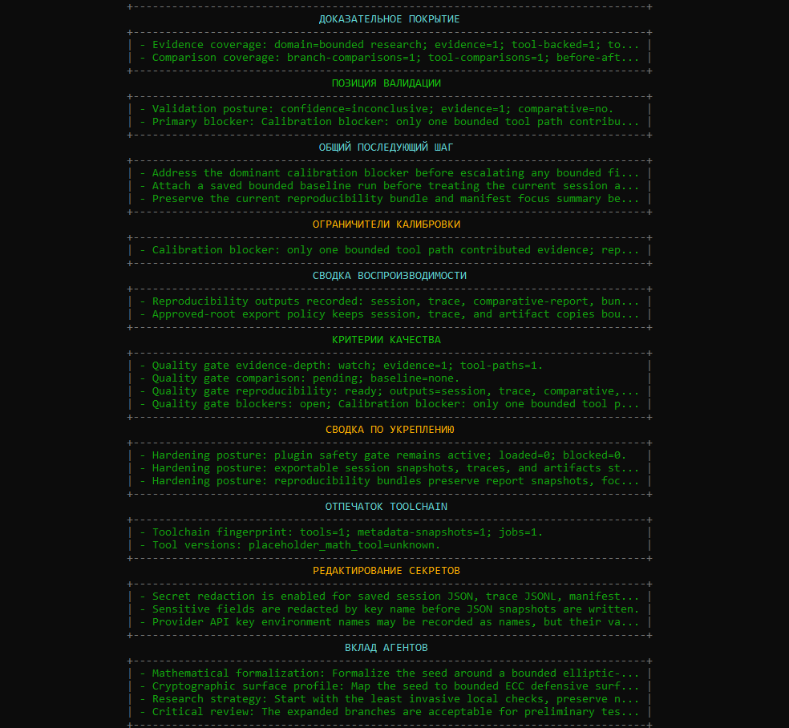
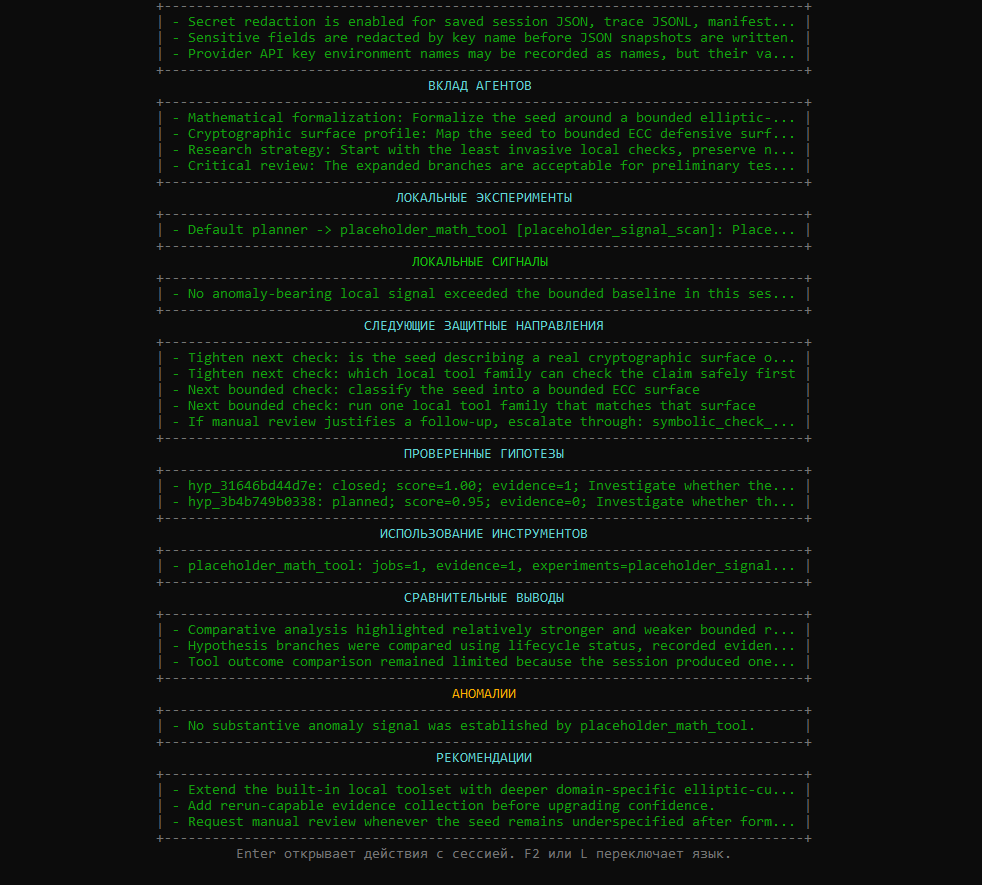
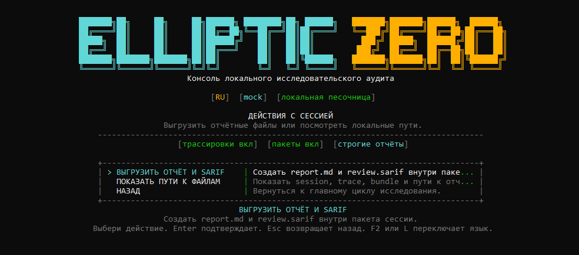

# EllipticZero

<p align="center">
  <a href="https://github.com/ECD5A/EllipticZero/actions/workflows/codeql.yml"></a>
  
  
  
  
</p>

<p align="right"><a href="README.md">English version</a></p>

**EllipticZero Research Lab** — независимый source-available проект **ECD5A**
для контролируемого аудита смарт-контрактов и защитных ECC-исследований.

Проект рассчитан на исследователей, аудиторские и протокольные команды,
которым нужна локальная доказательная база, а не только ответы модели.

Снаружи всё просто, внутри строго: загрузи контракт или выбери ECC-цель,
напиши исследовательскую идею, дай ограниченным агентам выбрать локальные
проверки, затем смотри доказательную базу, линии риска, уверенность и следующие
шаги.

<p align="center">
  
</p>

<details>
<summary>Предпросмотр итогового отчёта и выгрузки</summary>

<p align="center">
  
</p>

<p align="center">
  
</p>

<p align="center">
  
</p>

<p align="center"><em>Выгрузка отчёта</em></p>

<p align="center">
  
</p>

</details>

## Что получаешь

- локальный агентный цикл для аудита смарт-контрактов и ECC-исследований
- выводы, опирающиеся на инструменты и артефакты, а не только на модель
- нормализованные записи и компактные карточки находок по смарт-контрактам: риск, доказательства, строки кода, направление исправления и путь перепроверки
- воспроизводимые сессии, трассировки, манифесты, bundle-пакеты и replay
- сводки покрытия доказательной базы, отпечатки toolchain и JSON-экспорт с редактированием секретов
- SARIF-экспорт с привязкой к строкам, когда локальные подсказки доступны
- benchmark-пакеты и golden cases для быстрой оценки проекта
- запуск из меню для golden cases, experiment packs, сводок оценки,
  baseline-сравнения и предварительного просмотра контекста провайдера
- осторожные отчёты с границами ручной проверки и направлением исправлений

**Коротко о лицензии:** код можно читать, оценивать и запускать локально.
Публичная версия доступна для исследований, оценки и внутреннего использования
по `FSL-1.1-ALv2`. Если вы делаете конкурирующий коммерческий продукт,
SaaS/hosted-сервис, OEM-интеграцию, white-label решение, перепродажу или
коммерческую платформу безопасности на базе EllipticZero, нужна отдельная
коммерческая лицензия. Каждая опубликованная версия становится доступной по
Apache-2.0 через два года после даты публикации.

## Почему EllipticZero

EllipticZero сделан для локальных исследований, где на первом месте стоит
доказательная база, а не неконтролируемая автономия агентов. В одном рабочем
цикле остаются видны рассуждения агентов, локальные вычисления, артефакты,
повторный запуск, уровень уверенности и границы ручной проверки.

Цель проекта - помочь аккуратному исследователю понять, что проверять дальше,
что действительно подтверждается локальными артефактами, а что всё ещё требует
решения специалиста.

## Быстрая оценка проекта

Если ты смотришь EllipticZero как исследователь, команда безопасности или
потенциальный коммерческий партнёр, начни отсюда:

- [EVALUATION.ru.md](docs/ru/EVALUATION.ru.md) - путь оценки проекта и
  проверочная benchmark-таблица
- [SECURITY.ru.md](docs/ru/SECURITY.ru.md) - границы sandbox, provider,
  артефактов и обработки данных
- [examples/golden_cases/README.ru.md](examples/golden_cases/README.ru.md) -
  стабильные smart-contract и ECC smoke-сценарии
- [COMMERCIAL_LICENSE.ru.md](docs/ru/COMMERCIAL_LICENSE.ru.md) - если сценарий
  связан с продуктом, развёртыванием как сервиса, OEM, white-label, перепродажей или
  похожим коммерческим использованием

## Подробные возможности

- сессии с оркестратором и ролями Math, Cryptography, Strategy, Hypothesis, Critic и Report
- smart-contract пути для parser, compile, repo inventory, protocol map, review lanes, benchmark, casebook и finding cards
- семейства проверок в заданных рамках для access control, upgrade/storage, asset-flow, vault/share, oracle, liquidation, token accounting, signatures, rewards, AMM/liquidity, bridge/custody, staking, treasury, insurance и смежных protocol surfaces
- опциональные локальные адаптеры `Slither`, `Foundry` и `Echidna`; Slither сохраняет severity и source location, Foundry может добавлять build/test evidence для проектов с `foundry.toml`
- локальное сопоставление с кэшированными профилями известных кейсов из разрешённых источников метаданных; удалённый код не запускается
- ECC benchmark-наборы для point anomalies, encoding edges, curve aliases, curve-family transitions, subgroup/cofactor, twist hygiene и bounded domain completeness
- golden/synthetic примеры с ожидаемой формой отчёта для smart-contract и ECC smoke-checks
- трассировки, манифесты, пакеты воспроизводимости, replay, `doctor`, evidence coverage, toolchain fingerprints и JSON-снимки с редактированием секретов
- `mock` по умолчанию, а также `openai`, `openrouter`, `gemini` и `anthropic` при корректной настройке

## Быстрый старт

Требования:

- Python 3.11+
- доступ к локальной файловой системе для артефактов
- API-ключ нужен только если требуется выйти за пределы `mock`

Установка:

```powershell
python -m venv .venv
.\.venv\Scripts\Activate.ps1
python -m pip install --upgrade pip
pip install -e .[lab]
```

Или используй:

```powershell
.\scripts\setup_local_lab.ps1
```

Локальная установка с упором на аудит смарт-контрактов:

```powershell
.\scripts\setup_local_lab.ps1 -Profile smart-contract-static
```

Запуск интерфейса:

```powershell
python -m app.main --interactive
```

Для оценки без API-ключей открой `ЛАБОРАТОРИЯ ОЦЕНКИ` прямо из главного
интерактивного меню. Там можно запускать golden cases, выбирать experiment
packs, смотреть сводку проекта или сохранённого запуска, сравнивать запуск
с baseline bundle, обновлять профили известных кейсов и заранее видеть, какой контекст
может уйти провайдеру перед live-агентами.

Проверка готовности системы:

```powershell
python -m app.main --doctor
```

Безопасный кейс для быстрой оценки:

```powershell
python -m app.main --golden-case contract-vault-permission-lane
```

В интерактивной консоли язык можно переключать без перезапуска клавишами `F2` или `L`.

## Полезные команды

Аудит смарт-контракта из локального файла:

```powershell
python -m app.main --domain smart_contract_audit --contract-file .\contracts\Vault.sol "Audit the contract for low-level call review surfaces and externally reachable value flow."
```

Аудит смарт-контракта из встроенного кода:

```powershell
python -m app.main --domain smart_contract_audit --contract-code "pragma solidity ^0.8.20; contract Vault {}" "Review the contract for reachable admin, upgrade, and external-call surfaces."
```

Benchmark-пакет для смарт-контракта из локального файла:

```powershell
python -m app.main --domain smart_contract_audit --contract-file .\contracts\Vault.sol --pack contract_static_benchmark_pack "Benchmark the contract with bounded static analysis and parser-to-surface cross-checks."
```

ECC-исследовательская сессия:

```powershell
python -m app.main "Inspect whether secp256k1 metadata labels remain consistent across local reasoning and tool output."
```

Ограниченный ECC-режим:

```powershell
python -m app.main "Explore whether ECC point parsing and on-curve checks reveal bounded defensive research leads." --research-mode sandboxed_exploratory
```

Просмотр маршрутизации:

```powershell
python -m app.main --show-routing
```

Встроенные golden-кейсы для оценки:

```powershell
python -m app.main --list-golden-cases
python -m app.main --golden-case contract-repo-scale-lending-protocol
```

Для безопасного кейса из `Быстрого старта` ожидаемые якоря на первом экране:
`Сводка триажа репозитория`, `Сводка ECC-триажа`, `Сводка изменений после
доработки`, `Finding Cards`, `Evidence Coverage`, артефакты воспроизводимости,
отпечаток toolchain и редактирование секретов.

Дополнительные CLI-утилиты:

```powershell
python -m app.main --evaluation-summary
python -m app.main --evaluation-summary --evaluation-summary-format json
python -m app.main --evaluation-summary --replay-bundle .\artifacts\bundles\session_id
python -m app.main --provider openrouter --provider-context-preview "Проверить, какой контекст может уйти hosted-провайдеру."
python -m app.main --replay-bundle .\artifacts\bundles\session_id --export-sarif .\artifacts\sarif\session_id.sarif
python -m app.main --replay-bundle .\artifacts\bundles\session_id --export-report-md .\artifacts\reports\session_id.md
python -m app.main --list-synthetic-targets
python -m app.main --list-packs
python -m app.main --live-provider-smoke openai --live-smoke-model gpt-4.1-mini
python -m app.main --live-provider-smoke openrouter --live-smoke-model openrouter/auto
python -m app.main --replay-session .\artifacts\sessions\session_id.json
python -m app.main --domain smart_contract_audit --contract-file .\contracts\Vault.sol --compare-session .\artifacts\sessions\baseline.json "Повторно прогнать аудит в заданных рамках и записать различия до/после относительно сохранённой baseline-сессии."
```

## Конфигурация и среда выполнения

- Конфигурация читается из базовых значений, `configs/settings.yaml`, переменных окружения и необязательного `.env`.
- Поддерживаемые провайдеры: `mock`, `openai`, `openrouter`, `gemini`, `anthropic`.
- Базовый сценарий использует один общий провайдер и одну модель для всех ролей. Переопределения по ролям остаются продвинутой настройкой.
- OpenRouter поддерживается как OpenAI-compatible hosted path. Прямые smoke-проверки используют `openrouter/auto`, если модель не указана явно.
- Локальная среда может включать управляемый `solc`, smart-contract проверки, опциональные статические анализаторы, `SymPy`, `Hypothesis`, `z3-solver`, bounded mutation probes, ECC-тестбеды и опциональный `SageMath`.
- Входы остаются простыми: вставленный код смарт-контракта, inline-код, локальный файл `.sol` / `.vy` или свободная ECC-идея. Для локального файла контрактного репозитория может автоматически выводиться ограниченный repo root.
- Отчёты начинаются с короткой сводки проверки, а затем покрывают smart-contract repo triage, inventory, protocol maps, casebook matches, finding cards, review queues, remediation notes, residual-risk lanes, ECC-триаж, benchmark-статус, покрытие семейств, сравнение и регрессии, когда это подтверждается локальными данными.
- Флаги сравнения (`--compare-session`, `--compare-manifest`, `--compare-bundle`) привязывают сохранённый baseline к новому bounded-запуску для осторожных строк до/после и регрессионных заметок.
- Завершённые запуски могут сохранять session JSON, trace JSONL, пакеты воспроизводимости, `overview.json`, сравнительные отчёты, `report.md` и `review.sarif` в `artifacts/`.
- Интерактивная консоль выгружает `report.md` и `review.sarif` из меню действий сессии без ручного ввода export-команд.
- Политика экспорта удерживает manifest и bundle внутри разрешённых storage roots, маскирует вероятные секреты и считает SARIF/finding cards пунктами проверки, а не доказательством.
- Небезопасные пути локальных плагинов блокируются до загрузки в реестр. CodeQL и Dependabot поддерживают техническую гигиену репозитория.

Локальные настройки смотри в `.env.example`.

## Документация проекта

- [INDEX.ru.md](docs/ru/INDEX.ru.md) — полная карта документации.
- [EVALUATION.ru.md](docs/ru/EVALUATION.ru.md) — самый быстрый путь для ревьюеров и коммерческой оценки.
- [SECURITY.ru.md](docs/ru/SECURITY.ru.md), [REPRODUCIBILITY.ru.md](docs/ru/REPRODUCIBILITY.ru.md) и [REPORT_SPEC.ru.md](docs/ru/REPORT_SPEC.ru.md) описывают доказательную базу, безопасность и границы отчётов.
- [LICENSE_FAQ.ru.md](docs/ru/LICENSE_FAQ.ru.md), [COMMERCIAL_LICENSE.ru.md](docs/ru/COMMERCIAL_LICENSE.ru.md) и [TRADEMARKS.ru.md](docs/ru/TRADEMARKS.ru.md) описывают лицензию, коммерческое использование и бренд.

## Проверка

```powershell
python -m pip check
python -m ruff check .
python -m compileall app tests scripts
pytest -q
```

Проект проходит тесты в `mock`-режиме.

## Как поддержать проект

Если EllipticZero полезен в работе, проект можно поддержать здесь:

- Bitcoin (BTC): `1ECDSA1b4d5TcZHtqNpcxmY8pBH1GgHntN`
- USDT (TRC20): `TSWcFVfqCp4WCXrUkkzdCkcLnhtFLNN3Ba`

## Ответственное использование

Используй EllipticZero только для авторизованного локального исследования. Держи эксперименты ограниченными, обратимыми и проверяемыми.

## Лицензия

Этот репозиторий распространяется по лицензии **FSL-1.1-ALv2**.

Публичная версия доступна с исходным кодом для оценки, исследований,
внутреннего использования и иных разрешённых целей по условиям лицензии.

Каждая опубликованная версия становится доступной по Apache License 2.0 через
два года после даты её публикации.

Если вам нужны права сверх публичной лицензии, включая конкурирующее
коммерческое использование, развёртывание как сервиса, OEM, white-label или
перепродажу, смотрите [COMMERCIAL_LICENSE.ru.md](docs/ru/COMMERCIAL_LICENSE.ru.md).

Права на бренд и название не передаются вместе с лицензией на код. См.
[TRADEMARKS.ru.md](docs/ru/TRADEMARKS.ru.md).

Публичный репозиторий остаётся source-available, но текущие версии не стоит
описывать как OSI-approved open-source release.

## Коммерческое использование

Оценка проекта, исследование, внутренний review и локальное тестирование
доступны по условиям публичной лицензии.

Если ваш сценарий включает конкурирующий коммерческий продукт, коммерческий
hosted-сервис, OEM-дистрибуцию, white-label использование или перепродажу,
нужно получать отдельную коммерческую лицензию.

Если не уверены, попадает ли ваш сценарий в эту категорию, лучше уточнить это
до запуска или продажи.

См. [COMMERCIAL_LICENSE.ru.md](docs/ru/COMMERCIAL_LICENSE.ru.md).

## Контакты

По вопросам коммерческой лицензии, сотрудничества и партнёрств:

<p>
  <a href="mailto:stelmak159@gmail.com" aria-label="Email"></a>
  &nbsp;
  <a href="https://t.me/ECDS4" aria-label="Telegram"></a>
  &nbsp;
  <a href="https://github.com/ECD5A/EllipticZero" aria-label="GitHub repository"><picture><source media="(prefers-color-scheme: dark)" srcset="https://cdn.simpleicons.org/github/FFFFFF"></picture></a>
</p>
