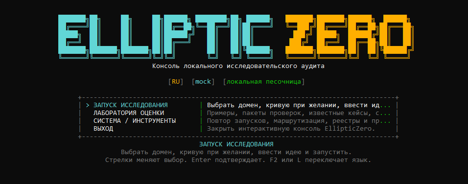
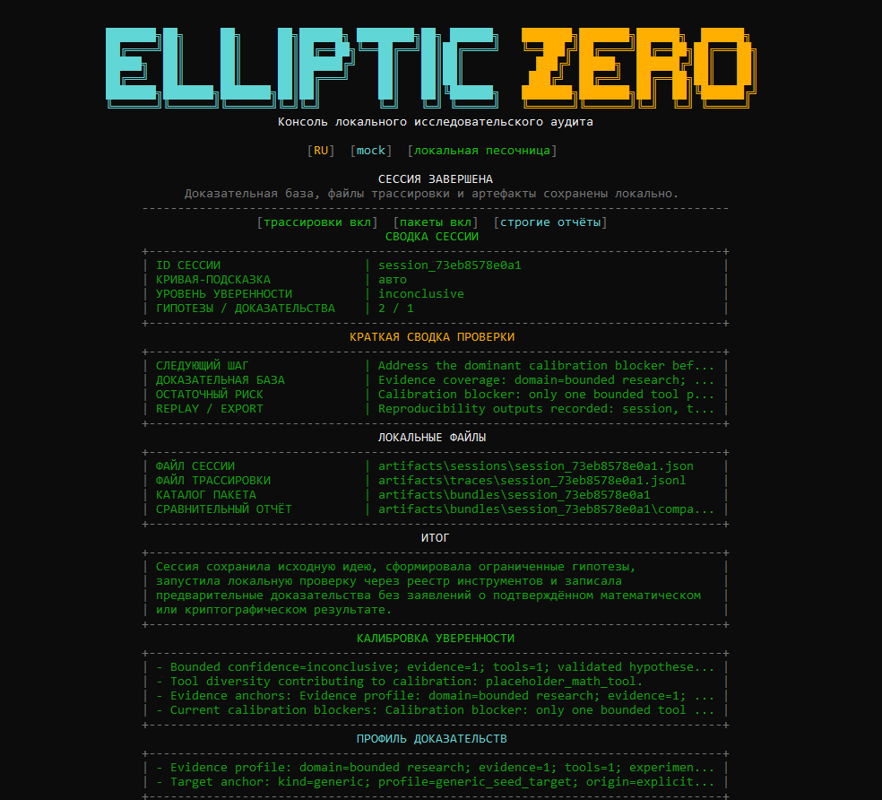

# EllipticZero

<p align="center">
  <a href="https://github.com/ECD5A/EllipticZero/actions/workflows/codeql.yml"></a>
  
  
  
  
</p>

<p align="right"><a href="README.md">English version</a></p>

EllipticZero — локальная source-available лаборатория для ограниченных
защитных ECC-исследований и аудита смарт-контрактов.

Проект рассчитан на исследователей, аудиторские и протокольные команды,
которым нужна локальная доказательная база, а не только ответы модели.

Снаружи все просто, внутри строго: загрузи контракт или выбери ECC-цель,
напиши исследовательскую идею, дай ограниченным агентам выбрать локальные
проверки, затем смотри доказательную базу, риск-линии, уверенность и следующие
шаги.

<p align="center">
  
</p>

<details>
<summary>Предпросмотр итогового отчёта</summary>

<p align="center">
  
</p>

</details>

## Что получаешь

- локальный агентный цикл для ECC-исследований и аудита смарт-контрактов
- выводы, опирающиеся на инструменты и артефакты, а не только на модель
- компактные карточки находок по смарт-контрактам: риск, доказательства, направление исправления и путь перепроверки
- воспроизводимые сессии, трассировки, манифесты, bundle-пакеты и replay
- сводки покрытия доказательной базы, отпечатки toolchain и JSON-экспорт с редактированием секретов
- benchmark-пакеты и golden cases для быстрой оценки проекта
- осторожные отчёты с границами ручной проверки и направлением исправлений

**Коротко о лицензии:** код можно читать, оценивать и запускать локально.
Публичная версия доступна для исследований, оценки и внутреннего использования
по `FSL-1.1-ALv2`. Если вы делаете конкурирующий коммерческий продукт,
SaaS/hosted-сервис, OEM-интеграцию, white-label решение, перепродажу или
коммерческую платформу безопасности на базе EllipticZero, нужна отдельная
коммерческая лицензия. Каждая опубликованная версия становится доступной по
Apache-2.0 через два года после даты публикации.

## Почему EllipticZero

EllipticZero сделан для локальных исследований, где на первом месте стоит
доказательная база, а не неконтролируемая автономия агентов. В одном рабочем
цикле остаются видны рассуждения агентов, локальные вычисления, артефакты,
повторный запуск, уровень уверенности и границы ручной проверки.

Цель проекта - помочь аккуратному исследователю понять, что проверять дальше,
что действительно подтверждается локальными артефактами, а что все еще требует
решения специалиста.

## Быстрая оценка проекта

Если ты смотришь EllipticZero как исследователь, команда безопасности или
потенциальный коммерческий партнёр, начни отсюда:

- [EVALUATION.ru.md](docs/ru/EVALUATION.ru.md) - путь оценки проекта и
  проверочная benchmark-таблица
- [SECURITY.ru.md](docs/ru/SECURITY.ru.md) - границы sandbox, provider,
  артефактов и обработки данных
- [examples/golden_cases/README.ru.md](examples/golden_cases/README.ru.md) -
  стабильные ECC- и smart-contract smoke-сценарии
- [COMMERCIAL_LICENSE.ru.md](docs/ru/COMMERCIAL_LICENSE.ru.md) - если сценарий
  связан с продуктом, развёртыванием как сервиса, OEM, white-label, перепродажей или
  похожим коммерческим использованием

## Подробные возможности

- исследовательские сессии с оркестратором в центре цикла
- агенты Math, Cryptography, Strategy, Hypothesis, Critic и Report
- локальные изолированные раннеры для символьных, формальных, property-based, фаззинг- и ECC testbed-проверок
- встроенные ECC benchmark-наборы для point anomalies, encoding edges, curve aliases, curve-family transitions, subgroup/cofactor и twist hygiene, а также bounded domain completeness
- инструменты аудита смарт-контрактов: разбор кода, компиляция, инвентаризация репозитория контрактов, ограниченный анализ импортов и зависимостей, карта протокольных модулей, маршруты обзора, приоритизация семейств функций и сведение межфайловых сигналов в общие приоритеты
- встроенные проверочные корпуса для asset-flow, vault/share, oracle freshness, collateral/liquidation и liquidation-fee review, protocol-fee/reserve-buffer/debt accounting, bad-debt socialization и смежных protocol-style семейств обзора
- ограниченные repo-casebook сценарии для upgrade/storage, governance/timelock, asset-flow, oracle/liquidation, protocol accounting, rewards/distribution, stablecoin/collateral, AMM/liquidity, bridge/custody, staking/rebase, keeper/auction, treasury/vesting, insurance/recovery и vault/permit, а также опциональные адаптеры `Slither`, `Foundry` и `Echidna`, если они установлены локально
- встроенные smart-contract benchmark-пакеты для static baseline review, repo-casebook benchmarking, protocol-style repo benchmarking, а также для governance/timelock, rewards/distribution, stablecoin/collateral, AMM/liquidity, bridge/custody, staking/rebase, keeper/auction, treasury/vesting, insurance/recovery, vault/permission и lending-style проходов
- golden/synthetic примеры с ожидаемыми формами отчётов для быстрой оценки ECC- и smart-contract smoke-checks
- трассировки, манифесты, пакеты воспроизводимости, повторный запуск и `doctor`
- сводки покрытия доказательной базы, компактные report snapshot-сводки, отпечатки toolchain и session/trace/bundle JSON-снимки с редактированием секретов
- `mock` по умолчанию, а также `openai`, `openrouter`, `gemini` и `anthropic` при корректной настройке

## Быстрый старт

Требования:

- Python 3.11+
- доступ к локальной файловой системе для артефактов
- API-ключ нужен только если требуется выйти за пределы `mock`

Установка:

```powershell
python -m venv .venv
.\.venv\Scripts\Activate.ps1
python -m pip install --upgrade pip
pip install -e .[lab]
```

Или используй:

```powershell
.\scripts\setup_local_lab.ps1
```

Локальная установка с упором на аудит смарт-контрактов:

```powershell
.\scripts\setup_local_lab.ps1 -Profile smart-contract-static
```

Запуск интерфейса:

```powershell
python -m app.main --interactive
```

Проверка готовности системы:

```powershell
python -m app.main --doctor
```

Безопасный кейс для быстрой оценки:

```powershell
python -m app.main --golden-case contract-vault-permission-lane
```

В интерактивной консоли язык можно переключать без перезапуска клавишами `F2` или `L`.

## Полезные команды

Прямая исследовательская сессия:

```powershell
python -m app.main "Inspect whether secp256k1 metadata labels remain consistent across local reasoning and tool output."
```

Ограниченный исследовательский режим:

```powershell
python -m app.main "Explore whether ECC point parsing and on-curve checks reveal bounded defensive research leads." --research-mode sandboxed_exploratory
```

Аудит смарт-контракта из локального файла:

```powershell
python -m app.main --domain smart_contract_audit --contract-file .\contracts\Vault.sol "Audit the contract for low-level call review surfaces and externally reachable value flow."
```

Аудит смарт-контракта из встроенного кода:

```powershell
python -m app.main --domain smart_contract_audit --contract-code "pragma solidity ^0.8.20; contract Vault {}" "Review the contract for reachable admin, upgrade, and external-call surfaces."
```

Benchmark-пакет для смарт-контракта из локального файла:

```powershell
python -m app.main --domain smart_contract_audit --contract-file .\contracts\Vault.sol --pack contract_static_benchmark_pack "Benchmark the contract with bounded static analysis and parser-to-surface cross-checks."
```

Просмотр маршрутизации:

```powershell
python -m app.main --show-routing
```

Встроенные golden-кейсы для оценки:

```powershell
python -m app.main --list-golden-cases
python -m app.main --golden-case contract-repo-scale-lending-protocol
```

Для безопасного кейса из `Быстрого старта` ожидаемые якоря на первом экране:
`Сводка триажа репозитория`, `Сводка ECC-триажа`, `Сводка изменений после
доработки`, `Finding Cards`, `Evidence Coverage`, артефакты воспроизводимости,
отпечаток toolchain и редактирование секретов.

Дополнительные CLI-утилиты:

```powershell
python -m app.main --evaluation-summary
python -m app.main --evaluation-summary --evaluation-summary-format json
python -m app.main --evaluation-summary --replay-bundle .\artifacts\bundles\session_id
python -m app.main --provider openrouter --provider-context-preview "Проверить, какой контекст может уйти hosted-провайдеру."
python -m app.main --replay-bundle .\artifacts\bundles\session_id --export-sarif .\artifacts\sarif\session_id.sarif
python -m app.main --list-synthetic-targets
python -m app.main --list-packs
python -m app.main --live-provider-smoke openai --live-smoke-model gpt-4.1-mini
python -m app.main --live-provider-smoke openrouter --live-smoke-model openrouter/auto
python -m app.main --replay-session .\artifacts\sessions\session_id.json
python -m app.main --domain smart_contract_audit --contract-file .\contracts\Vault.sol --compare-session .\artifacts\sessions\baseline.json "Повторно прогнать bounded-аудит и записать различия до/после относительно сохранённой baseline-сессии."
```

## Конфигурация и среда выполнения

- Конфигурация читается из базовых значений, `configs/settings.yaml`, переменных окружения и необязательного `.env`.
- Поддерживаемые провайдеры: `mock`, `openai`, `openrouter`, `gemini`, `anthropic`.
- Нормальный сценарий — один общий провайдер и одна модель для всех ролей. Переопределения по ролям доступны как продвинутый вариант настройки.
- OpenRouter может быть удобным bounded smoke-путём для live-проверки, потому что даёт OpenAI-compatible API и единый ключ для многих моделей. Если использовать варианты с суффиксом `:free`, относись к ним как к удобной проверке, а не как к гарантированной среде выполнения: у OpenRouter есть свои лимиты по частоте и дневному объёму таких запросов.
- Локальная среда может включать `SymPy`, `Hypothesis`, `z3-solver`, встроенные мутационные пробы, ECC-тестбеды, проверки для аудита смарт-контрактов и `SageMath`, если он доступен.
- ECC-отчёт теперь может включать компактную сводку ECC-триажа, краткую benchmark-сводку, benchmark-статус, покрытие ECC-семейств, короткие сводки по benchmark-кейсам, bounded ECC review focus, строки с остаточным риском, заметки по согласованности ECC-сигналов, короткую ECC validation matrix, осторожные строки ECC-сравнения до/после, заметки по ECC benchmark-delta и ECC-регрессионные дельты, когда локальные сигналы по encoding, family transitions, twist hygiene, subgroup/cofactor или domain completeness это оправдывают.
- Setup-профили могут развернуть управляемый Solidity-компилятор в `.ellipticzero/tooling/solcx`, чтобы проверки компиляции и зависящие от компилятора адаптеры не зависели от глобальной установки `solc`.
- Анализ Solidity работает с учётом версии: сначала читается `pragma` контракта, а затем система выбирает совместимый локально доступный управляемый компилятор вместо привязки к одной фиксированной версии `solc`.
- Для аудита смарт-контрактов можно использовать вставку кода, встроенный код в CLI или локальный файл `.sol` / `.vy`.
- `doctor` теперь отдельно показывает конфигурацию провайдера и готовность hosted live-smoke path, а прямой smoke-run выводит фактический тайм-аут и лимит токенов запроса.
- `--provider-context-preview` показывает, какие маршруты агентов будут использовать hosted providers и может ли подготовленный контекст контракта уйти с локальной машины до live-запуска.
- `doctor` теперь также показывает bounded local plugin safety gate и политику approved export roots, используемую при экспорте manifest и bundle.
- Сессия по смарт-контракту может нести локальный корень контрактного репозитория, чтобы ограниченный аудит строил инвентаризацию репозитория, маршруты обзора по entrypoint-файлам, приоритеты семейств функций, сводки по маршрутам семейств рисков, подсказки по общим зависимостям и сравнение с ограниченными repo-casebook сценариями. Если используется локальный файл контракта, интерактивный сценарий теперь автоматически выводит ограниченный локальный корень.
- Smart-contract experiment packs теперь могут структурировать bounded static benchmarking, repo-casebook benchmarking, protocol-style benchmark passes, а также более узкие governance/timelock, rewards/distribution, stablecoin/collateral, AMM/liquidity, bridge/custody, staking/rebase, keeper/auction, treasury/vesting, insurance/recovery, vault/permission и lending-style benchmark passes; их выполненные шаги сохраняются в сессии, replay-артефактах и итоговом отчёте.
- Прямые CLI-аргументы `--compare-session`, `--compare-manifest` и `--compare-bundle` теперь позволяют привязать сохранённую baseline-сессию к новому bounded-запуску, чтобы итоговый отчёт мог показать осторожные различия до/после и флаги возможных регрессий.
- Отчёт по смарт-контракту может включать компактную сводку триажа репозитория, инвентаризацию контрактов, карту протокольных модулей, инварианты протокола, сводку по согласованности сигналов, матрицу валидации, benchmark-статус, сильнейшие приоритеты по обзору репозитория, триаж первого ограниченного прохода, маршруты обзора по entrypoint-файлам, приоритеты семейств функций и сводки по семействам рисков.
- Отчёт по смарт-контракту может показывать компактные карточки находок, где bounded потенциальный issue связан с локальной доказательной базой, причиной важности, направлением защитной доработки и путём повторной проверки.
- Отчёт по смарт-контракту также может включать сводку по ограниченному покрытию repo-casebook, компактные сводки по совпавшим сценариям, archetype-style подписи для governance/timelock, rewards/distribution, stablecoin/collateral, AMM/liquidity, bridge/custody, staking/rebase, keeper/auction, treasury/vesting, insurance/recovery и похожих protocol-style case-study линий, короткие строки с ключевыми совпавшими кейсами, короткий блок с оставшимися пробелами, benchmark-сводки, casebook-triage и блок связки инструментов для сильнейших маршрутов обзора по репозиторию.
- Отчёт по смарт-контракту также может включать сводки по benchmark-пакетам и короткие benchmark-case summary, если bounded contract benchmark pack материально влиял на сессию.
- Отчёт по смарт-контракту также может включать матрицу покрытия casebook, benchmark-статус и более жёсткий validation posture для сильнейших маршрутов обзора по репозиторию, включая bounded repo-casebook-сценарии, которые поддерживают сразу несколько семейств рисков в одном проходе.
- Когда локальные сигналы это оправдывают, отчёт по смарт-контракту может также включать короткую очередь проверки, строки с остаточным риском для сильнейших маршрутов обзора, критерии завершения для сильнейшего маршрута обзора, статус компиляции, сводку по поверхности контракта, встроенные результаты проверок риск-паттернов, протокольный фокус, заметки по ограниченной проверке защитной доработки, компактную сводку изменений после доработки, приоритеты повторной проверки после доработки, осторожные рекомендации по защитной доработке, внешние результаты статического анализа и сравнение с ограниченными проверочными корпусами или repo-casebook-сценариями, где replay-путь может идти сразу по нескольким совпавшим семействам, если маршрут обзора действительно их объединяет, а также строки сравнения до/после и флаги возможных регрессий, когда к запуску привязана сохранённая baseline-сессия.
- Завершённые запуски могут сохранять файл сессии, трассировку, сравнительный отчёт и пакет воспроизводимости в `artifacts/`, а пакет воспроизводимости теперь включает `overview.json` с report snapshot-сводками, сводкой фокуса, готовностью к сравнению, экспортными счётчиками и сводками по quality gates / hardening.
- Сохранённые запуски можно экспортировать в SARIF 2.1.0 для CI или GitHub Code Scanning; SARIF-записи остаются пунктами проверки и не превращают ограниченные сигналы в подтверждённые уязвимости.
- Кросс-доменный отчёт теперь тоже может сохранять quality gates и hardening summary, чтобы глубина доказательной базы, готовность к сравнению, export posture и остаточные manual-review lanes были видны в одном месте.
- Manifest и bundle теперь фильтруют ссылки на артефакты, которые разрешаются вне approved local storage roots, а session/trace copies экспортируются только если исходные пути остаются внутри этих разрешённых корней.
- Unsafe local plugin path layouts блокируются ещё до загрузки в реестр.

Локальные настройки смотри в `.env.example`.

## Документация проекта

- [INDEX.ru.md](docs/ru/INDEX.ru.md)
- [EVALUATION.ru.md](docs/ru/EVALUATION.ru.md)
- [CHANGELOG.ru.md](docs/ru/CHANGELOG.ru.md)
- [USE_CASES.ru.md](docs/ru/USE_CASES.ru.md)
- [ENVIRONMENT_PROFILES.ru.md](docs/ru/ENVIRONMENT_PROFILES.ru.md)
- [ARCHITECTURE.ru.md](docs/ru/ARCHITECTURE.ru.md)
- [AGENTS.ru.md](docs/ru/AGENTS.ru.md)
- [LICENSE_FAQ.ru.md](docs/ru/LICENSE_FAQ.ru.md)
- [LICENSE_TRANSITION.ru.md](docs/ru/LICENSE_TRANSITION.ru.md)
- [COMMERCIAL_LICENSE.ru.md](docs/ru/COMMERCIAL_LICENSE.ru.md)
- [TRADEMARKS.ru.md](docs/ru/TRADEMARKS.ru.md)
- [REPRODUCIBILITY.ru.md](docs/ru/REPRODUCIBILITY.ru.md)
- [REPORT_SPEC.ru.md](docs/ru/REPORT_SPEC.ru.md)
- [SECURITY.ru.md](docs/ru/SECURITY.ru.md)
- [CONTRIBUTING.ru.md](docs/ru/CONTRIBUTING.ru.md)
- [examples/README.ru.md](examples/README.ru.md)
- [examples/SAMPLE_OUTPUTS.ru.md](examples/SAMPLE_OUTPUTS.ru.md)
- [examples/golden_cases/README.ru.md](examples/golden_cases/README.ru.md)
- [examples/golden_cases/RUNBOOK.ru.md](examples/golden_cases/RUNBOOK.ru.md)
- [examples/golden_cases/EXPECTED_REPORT_SHAPES.ru.md](examples/golden_cases/EXPECTED_REPORT_SHAPES.ru.md)

## Проверка

```powershell
python -m pip check
python -m ruff check .
python -m compileall app tests scripts
pytest -q
```

Сейчас проект проходит тесты в `mock`-режиме.

## Как поддержать проект

Если EllipticZero полезен в работе, проект можно поддержать здесь:

- Bitcoin (BTC): `1ECDSA1b4d5TcZHtqNpcxmY8pBH1GgHntN`
- USDT (TRC20): `TSWcFVfqCp4WCXrUkkzdCkcLnhtFLNN3Ba`

## Ответственное использование

Используй EllipticZero только для авторизованного локального исследования. Держи эксперименты ограниченными, обратимыми и проверяемыми.

## Лицензия

Этот репозиторий распространяется по лицензии **FSL-1.1-ALv2**.

Публичная версия доступна с исходным кодом для оценки, исследований,
внутреннего использования и иных разрешённых целей по условиям лицензии.

Каждая опубликованная версия становится доступной по Apache License 2.0 через
два года после даты её публикации.

Если вам нужны права сверх публичной лицензии, включая конкурирующее
коммерческое использование, развёртывание как сервиса, OEM, white-label или
перепродажу, смотрите [COMMERCIAL_LICENSE.ru.md](docs/ru/COMMERCIAL_LICENSE.ru.md).

Права на бренд и название не передаются вместе с лицензией на код. См.
[TRADEMARKS.ru.md](docs/ru/TRADEMARKS.ru.md).

Публичный репозиторий остаётся source-available, но текущие версии не стоит
описывать как OSI-approved open-source release.

## Коммерческое использование

Оценка проекта, исследование, внутренний review и локальное тестирование
доступны по условиям публичной лицензии.

Если ваш сценарий включает конкурирующий коммерческий продукт, коммерческий
hosted-сервис, OEM-дистрибуцию, white-label использование или перепродажу,
нужно получать отдельную коммерческую лицензию.

Если не уверены, попадает ли ваш сценарий в эту категорию, лучше уточнить это
до запуска или продажи.

См. [COMMERCIAL_LICENSE.ru.md](docs/ru/COMMERCIAL_LICENSE.ru.md).

## Контакты

По вопросам коммерческой лицензии, сотрудничества и партнёрств:

<p>
  <a href="mailto:stelmak159@gmail.com" aria-label="Email"></a>
  &nbsp;
  <a href="https://t.me/ECDS4" aria-label="Telegram"></a>
  &nbsp;
  <a href="https://github.com/ECD5A/EllipticZero" aria-label="GitHub repository"><picture><source media="(prefers-color-scheme: dark)" srcset="https://cdn.simpleicons.org/github/FFFFFF"></picture></a>
</p>
